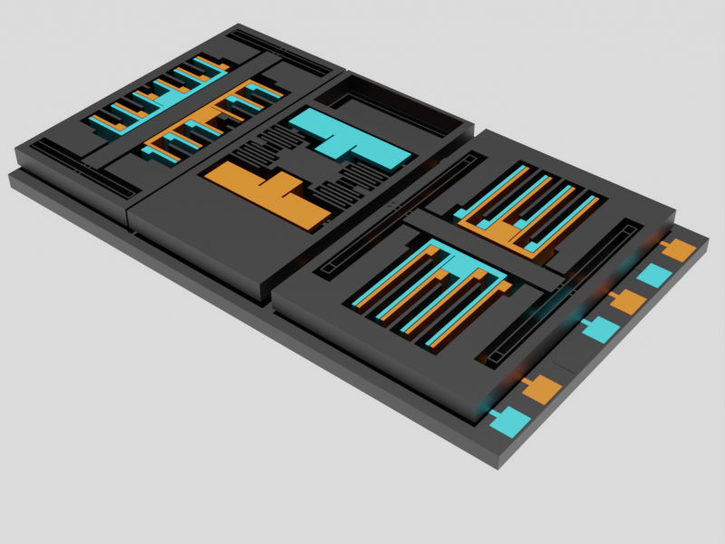

# 3-Axis Accelerometer Model
	
	
# Description

This is a scaled-up generic MEMS 3-axis accelerometer 3D model for educational purposes.

# Requirements
- 3 colors of PETG fillament
- 3D printer with a 0.4mm nozzle and a printbed with at least 220mm width
- Clean buildplate with good adhesion is neccessary to prevent parts from coming of the build plate

For the proof masses to move as intended, the weight of the part and the stiffness of the springs need to be as described in this documentation.

# Part List and Printing Settings
## General Printing Settings
- Layer height: 0.2mm

## Part: Base (Base.STL)

To print the traces in color, the files *Base.STL*, *Base_circuit_color1.STL* and *Base_circuit_color2.STL* have to be imported to the slicer. After imported, assign the desired colors to the parts.

If you do not have automatic filament changing, you can use the *M600* G-code command to change it manually. The file should only require 4 filament changes. 

To increase the robustness of the top MEMS elements, use the *Modifier_mesh.STL*. This model increases the top layer count in the neccessary regions.

## Part: X-axis MEMS element (X_axis.STL)

### Printing Settings:
- Arachne: ON
- 1 Perimeter
- 3 Top Layers
- 1 Bottom Layer
- 15% Lightning Infill

To increase strength around the attachments, add a box as a modifier and set the perimeters to 3 and the bottom layers to 3.

## Parts: Z and Y-axis MEMS element (Z_axis.STL and Y_axis.STL)

### Printing Settings:
- Arachne: ON
- 2 Perimeters 
- 5 Top Layers
- 4 Bottom Layers
- 10% Cubic Infill

Once again a modifier in the shape of a box is required. It makes the section marked in the picture below solid with a width of 3mm. This applies only for the Z-axis whereas all the other settings are the same for the Y-axis.

## Parts: Electrodes

### Printing Settings:
- 2 Perimeters
- 5 Top Layers
- 3 Bottom Layers

## Part list:
### Color 1:
* 1x *X_axis_electrode_short*
* 3x *X_axis_electrode_long*
* 1x *X_axis_electrodes*
* 1x *Y_axis_electrode_short*
* 5x *Y_axis_electrode_long*
* 1x *Y_axis_electrodes*
* 1x *Z_axis_electrode_color1*

### Color 2:
* 1x *X_axis_electrode_short*
* 3x *X_axis_electrode_long*
* 1x *X_axis_electrodes*
* 1x *Y_axis_electrode_short*
* 5x *Y_axis_electrode_long*
* 1x *Y_axis_electrodes*
* 1x *Z_axis_electrode_color2*

	

