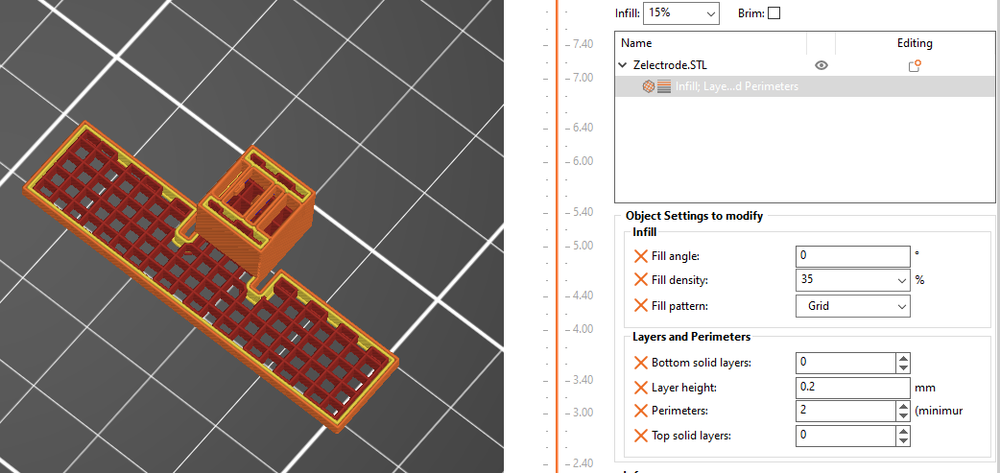

# 3-Axis Accelerometer Model
- [3-Axis Accelerometer Model](#3-axis-accelerometer-model)
- [Description](#description)
- [Requirements](#requirements)
- [Part List and Printing Settings](#part-list-and-printing-settings)
  - [General Printing Settings](#general-printing-settings)
  - [Part: Base (Base.STL)](#part-base-basestl)
  - [Part: X-Axis MEMS Element (X\_axis.STL)](#part-x-axis-mems-element-x_axisstl)
    - [Printing Settings:](#printing-settings)
  - [Part: Z-Axis MEMS Element (Z\_axis.STL)](#part-z-axis-mems-element-z_axisstl)
    - [Printing Settings:](#printing-settings-1)
  - [Part: Y-Axis MEMS Element (Y\_axis.STL)](#part-y-axis-mems-element-y_axisstl)
    - [Printing Settings:](#printing-settings-2)
  - [Parts: Electrodes](#parts-electrodes)
    - [Printing Settings](#printing-settings-3)
  - [Part List](#part-list)
    - [Color 1](#color-1)
    - [Color 2](#color-2)
- [Further Material](#further-material)

	
# Description

This is a scaled-up generic MEMS 3-axis accelerometer 3D model for educational purposes. 
The size of this model is about 250 times larger than that of a MEMS accelerometer.

# Requirements
- 3 colors of PETG filament
- 3D printer with a 0.4mm nozzle and a print bed with at least 220mm width
- Clean build plate with good adhesion is necessary to prevent parts from coming off the build plate while printing
- For the proof masses to move as intended, the print settings below need to be followed closely to get the right weight and stiffness

# Part List and Printing Settings

All the instructions are based on how one would print this project using Prusa Slicer but of course any other slicer should work just fine as well. Keep in mind that names for settings can differ.

## General Printing Settings
- Layer height: 0.2mm

## Part: Base (Base.STL)

To print the traces in color, first go to the printer settings tab and send the extruder count to 3, even if your printer does not have 3 extruder (if the option is not visible, just click on "expert mode").

Then drag the files *Base.STL*, *Base_circuit_color1.STL* and *Base_circuit_color2.STL* on to the build plate all at once. The slicer should now ask if it should align the parts, click yes. After imported, assign the desired colors to the parts.

If you do not have automatic filament changing, you can add the *M600* G-code command in the "Tool change G-code" input field to change it manually. The file should only require 4 filament changes. 

As this is a big part adding a brim will make it less likely to warp. To increase the robustness of the top MEMS elements, add the *Modifier_mesh.STL*  as a modifier, and set it to increase the top layer count. The below image shows how the model should look before slicing. 

With Prusa Slicer, a wipe tower might appear after setting the extruder count to 3, which is not necessary if you are using a printer without automatic filament changing. You can remove it under the "Wipe tower" section of the print settings.

## Part: X-Axis MEMS Element (X_axis.STL)

### Printing Settings:
- Perimeter Generator: Arachne
- 1 Perimeter
- 3 Top Layers
- 1 Bottom Layer
- 15% Lightning Infill

To increase strength around the attachments, add a box as a modifier by right clicking the part and set the perimeters to 3 and the bottom layers to 3. Make sure that the box does not encompass the meeting point between the springs and the middle rectangle.

## Part: Z-Axis MEMS Element (Z_axis.STL)

### Printing Settings:
- Perimeter Generator: Classic
- 1 Perimeters 
- 5 Top Layers
- 3 Bottom Layers
- 10% Cubic Infill
- Extrusion Width: 0.45mm

Once again a modifier is needed for the proper weight distribution. Add a box modifier to overlap the last 6mm of the model and set it 100% infill. 

## Part: Y-Axis MEMS Element (Y_axis.STL)

### Printing Settings:
- Perimeter Generator: Arachne
- 2 Perimeters 
- 5 Top Layers
- 4 Bottom Layers
- 10% Cubic Infill

This MEMS Element model does not require any modifier, just make sure the orientation of the part follows the picture bellow.

## Parts: Electrodes

### Printing Settings
- 2 Perimeters
- 5 Top Layers
- 3 Bottom Layers
- 10% infill

## Part List
The *Storage_lock.STL* is meant to avoid the part to creep during storage. The bump on it is supposed to go into the cavity below the Z-Axis. 

For more realistic Z-electrodes the you can apply these settings for printing the files *Z_axis_electrode_color1* & *Z_axis_electrode_color2*: 

- Fill angle: 0
- 0 Top Layers
- 0 Bottom Layers
- 35% Grid Infill

### Color 1
* 1x *X_axis_electrode_short*
* 3x *X_axis_electrode_long*
* 1x *X_axis_electrodes*
* 1x *Y_axis_electrode_short*
* 5x *Y_axis_electrode_long*
* 1x *Y_axis_electrodes*
* 1x *Z_axis_electrode_color1*

 

### Color 2
* 1x *X_axis_electrode_short*
* 3x *X_axis_electrode_long*
* 1x *X_axis_electrodes*
* 1x *Y_axis_electrode_short*
* 5x *Y_axis_electrode_long*
* 1x *Y_axis_electrodes*
* 1x *Z_axis_electrode_color2*

# Further Material
[Evolution of Bosch Inertial Measurement Units for Consumer Electronics [YouTube]](https://youtu.be/YX_pCtbetUU?si=Y48k9YNXbdLkJ2fi)

[Bosch MEMS sensors: Working principle of an accelerometer [YouTube]](https://youtu.be/RLQGZl0lpjQ?si=H11uKwXcvrlZT_3T)